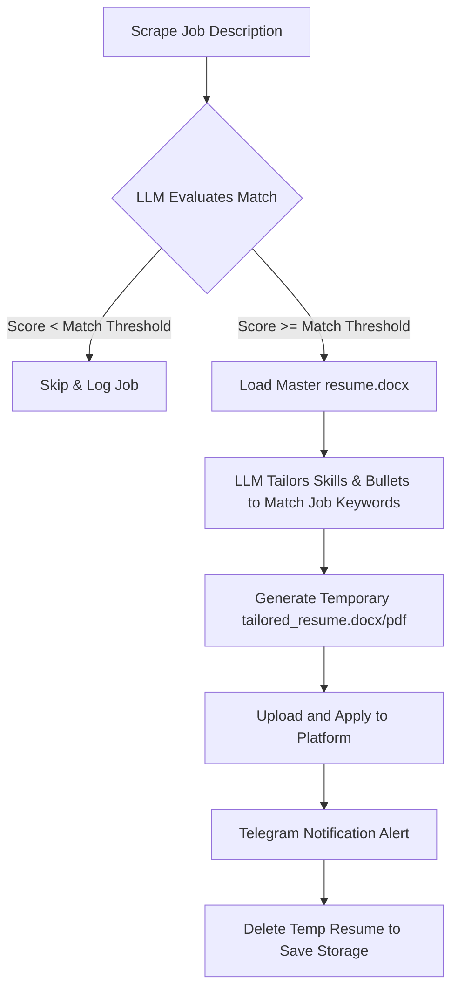

# 🤖 Agentic AI Job Application System

An autonomous, agentic Python system that runs in the background (or via a daily schedule at 9:00 AM IST), crawls job boards (Naukri, LinkedIn, Monster India, JoinDevOps), leverages advanced Large Language Models (LLMs) to evaluate and score job descriptions against your resume, dynamically tailors your resume for each specific job to optimize ATS compatibility, auto-applies, and sends instant notifications to your Telegram channel. All with human-like anti-detection behavior.

---

## ✨ Features

| Feature | Detail |
| :--- | :--- |
| **🔍 Multi-Platform Scraping** | Naukri.com · LinkedIn · Monster India · JoinDevOps.com |
| **🧠 Intelligent LLM Evaluation** | Reads job descriptions, rates matching score (0–100), and filters out low-match jobs based on custom thresholds (e.g. 70%) |
| **🎯 Dynamic ATS Resume Tailoring** | Modifies bullet points and skills in your `resume.docx` to align with the job description without altering your core experience, history, dates, or credentials |
| **✍️ Tailored Cover Letters** | Generates highly customized 3-paragraph cover letters tailored specifically to each role |
| **📱 Telegram Notifications** | Get real-time updates for every job scanned, matched, applied, or skipped, plus comprehensive daily summaries |
| **💾 SQLite Database Audit Trail** | Tracks application history to ensure zero duplicate applications and persistent tracking of status |
| **🕵️ Anti-Detection Protection** | Employs stealth-based Playwright browsers, dynamic randomized delays, realistic cursor/mouse movements, and character-by-character typing |
| **🔌 Pluggable LLM Framework** | Swap models seamlessly between Google Gemini, DeepSeek, OpenAI, local Ollama (Llama 3/Mistral), Groq, or Hugging Face via a single variable in `.env` |
| **🛡️ Smart Failover Engine** | Automatically switches to fallback LLM providers (e.g. HuggingFace or Gemini) if your primary provider runs out of credits or encounters rate limits |
| **🐳 Dockerized Architecture** | Fully containerized deployment with persisted volumes for databases, resume templates, and application logs |

---

## 📦 Prerequisites

Before deploying the agent, ensure you have the following:

* **Docker & Docker Desktop** (Recommended) — [Install here](https://www.docker.com/products/docker-desktop)
* **Git** — [Download here](https://git-scm.com/downloads)
* **Your Resume** — A master resume in `resume.docx` format (preferred for tailoring) or `resume.pdf`.
* **Platform Accounts** — Registered accounts on Naukri, LinkedIn, and/or Monster India.

---

## 🚀 Getting Started

You can run the application using **Docker (Recommended)** or **Locally with Python**.

### Path A: Docker Deployment (Recommended)

Docker is the easiest way to deploy because it pre-packages Chromium and all system dependencies.

#### 1. Clone & Prepare Directory
```bash
git clone <your-repo-url> job-agent
cd job-agent
cp .env.example .env
```

#### 2. Place Your Resume Template
Place your master resume in the uploads folder. The tailoring engine uses the `.docx` file as a base to produce dynamic, high-scoring ATS variations:
```text
job-agent/resume/uploads/
    ├── resume.docx   ← Required for dynamic tailoring template
    └── resume.pdf    ← Fallback PDF
```

#### 3. Build the Container
```bash
docker-compose build
# Note: First build takes 5-10 minutes as it downloads Chromium and Playwright assets
```

#### 4. Perform an Immediate Test Run
To verify everything works immediately without waiting for the daily cron schedule:
```bash
# Windows (CMD):
set RUN_NOW=true && docker-compose up

# Windows (PowerShell):
$env:RUN_NOW="true"; docker-compose up

# Linux / macOS:
RUN_NOW=true docker-compose up
```

#### 5. Start Daily Production Schedule
Once verified, run the container in detached background daemon mode. The scheduler will wake the agent every day at the configured hour (default `09:00` AM IST):
```bash
docker-compose up -d
```

---

### Path B: Local Python Installation

If you prefer to run the script bare-metal without containers:

#### 1. System Prerequisites
* **Python 3.10+**
* **Node.js** (for Playwright browser engines)

#### 2. Install Dependencies
```bash
pip install -r requirements.txt
playwright install chromium
```

#### 3. Configure and Run
```bash
cp .env.example .env
# Open and update your .env configurations
python main.py
```

---

## 📱 Telegram Bot Setup

The agent sends detailed notifications directly to your phone. Setup takes less than 3 minutes.

```text
  📨 Application Sent!
  🏢 Razorpay
  💼 Senior DevOps Engineer
  📍 Bangalore, India
  💰 20-30 LPA
  ⭐ Match Score: 88/100
  ✅ 5 years Kubernetes matches requirement
  ✅ Terraform experience aligns
```

### Step 1: Create a Bot via `@BotFather`
1. Open Telegram, search for `@BotFather`, and start a conversation.
2. Send the command `/newbot`.
3. Give your bot a friendly name (e.g., `My Career Agent`).
4. Give it a unique username ending in `bot` (e.g., `alex_job_agent_bot`).
5. Copy the **HTTP API Token** provided (looks like `7123456789:AAFxxxxxxxxxxxxxxxxxxxxxxxxxxxxxxxx`).
6. Set it in `.env`:
   ```env
   TELEGRAM_BOT_TOKEN=7123456789:AAFxxxxxxxxxxxxxxxxxxxxxxxxxxxxxxxx
   ```

### Step 2: Get Your Chat ID
1. Search for your new bot's username in Telegram and click **Start** or send a message.
2. Open your web browser and navigate to the following URL (replace `<YOUR_BOT_TOKEN>` with your token):
   ```text
   https://api.telegram.org/bot<YOUR_BOT_TOKEN>/getUpdates
   ```
3. Locate the JSON block containing `"chat"` and copy the `"id"` value:
   ```json
   { "chat": { "id": 123456789 } }
   ```
4. Set this in `.env`:
   ```env
   TELEGRAM_CHAT_ID=123456789
   ```

---

## 🧠 LLM Provider Configurations

The system features a pluggable LLM wrapper. Set the `LLM_PROVIDER` option in `.env` to swap providers without code modifications:

### 1. Google Gemini (⭐ Recommended — Free / Cheap Cloud)
Extremely fast and provides generous free tier credits.
```env
LLM_PROVIDER=gemini
GEMINI_API_KEY=AIzaSyxxxxxxxxxxxxxxxxxxxxxxxxxx
GEMINI_MODEL=gemini-1.5-flash
```
*Get your key at: [Google AI Studio](https://aistudio.google.com)*

### 2. DeepSeek (⭐ Recommended — Advanced Reasoning)
Outstanding performance at a low cost.
```env
LLM_PROVIDER=deepseek
DEEPSEEK_API_KEY=sk-xxxxxxxxxxxxxxxxxxxxxxxx
DEEPSEEK_MODEL=deepseek-chat
```
*Get your key at: [DeepSeek Developer Platform](https://platform.deepseek.com)*

### 3. Smart Failover (⭐ Recommended for Credit Limits)
If your primary model runs out of credits or encounters severe rate limiting, the agent automatically switches to your designated backup provider (e.g. falling back from OpenAI/Gemini to HuggingFace API/Ollama) to guarantee application runs are completed without interruption.
```env
LLM_PROVIDER=failover
# Provide keys for both to enable failover:
GEMINI_API_KEY=AIzaSyxxxxxxxxxxxxxxxxxxxxxxxxxx
HUGGINGFACE_API_KEY=hf_xxxxxxxxxxxxxxxxxxxxxxxx
```

### 4. Local Ollama (100% Free & Fully Private)
Runs local LLMs on your hardware. Great if you want zero cloud API keys.
```env
LLM_PROVIDER=ollama
OLLAMA_BASE_URL=http://localhost:11434
OLLAMA_MODEL=llama3
```
*For Docker containers running Ollama, ensure you use `OLLAMA_BASE_URL=http://host.docker.internal:11434` and enable `host.docker.internal` routing in your `docker-compose.yml`.*

### 5. Other Providers (OpenAI, HuggingFace, Groq)
```env
# Hugging Face Router
LLM_PROVIDER=huggingface
HUGGINGFACE_API_KEY=hf_xxxxxxxxxxxxxxxxxxxxxxxx

# OpenAI (ChatGPT)
LLM_PROVIDER=openai
OPENAI_API_KEY=sk-proj-xxxxxxxxxxxxxxxxxxxxxxxx
OPENAI_MODEL=gpt-4o-mini

# Groq Cloud
LLM_PROVIDER=groq
GROQ_API_KEY=gsk_xxxxxxxxxxxxxxxxxxxxxxxx
GROQ_MODEL=llama3-70b-8192
```

---

## 🎯 Dynamic Resume Tailoring Mechanism

The heart of the application is its **ATS Optimization Engine**:



> [!IMPORTANT]
> **Core Integrity Guarantee:** The tailoring engine specifically targets and adjusts only achievement bullets, core competency keywords, and technical skills to align with the job description. The core of your career history (e.g., company names, titles, employment dates, certifications, education, and contact details) **remains absolutely untouched**.

Once the tailored resume is successfully uploaded and submitted, the temporary file is immediately purged to save disk space and keep your system clean.

---

## 🔧 Environment Variables Reference

A detailed overview of key options configurable in `.env`:

| Variable | Default Value | Description |
| :--- | :--- | :--- |
| `LLM_PROVIDER` | `failover` | Main provider: `failover` \| `gemini` \| `deepseek` \| `ollama` \| `groq` \| `huggingface` \| `openai` \| `placeholder` |
| `MATCH_THRESHOLD` | `70` | Minimum LLM-evaluated score (0–100) needed to proceed with an application |
| `MAX_APPLICATIONS_PER_RUN` | `30` | Maximum limit of successfully submitted applications *per platform* per daily execution |
| `JOB_ROLES` | `DevOps Engineer,...` | Comma-separated search queries used for platform lookups |
| `JOB_LOCATIONS` | `India,Remote` | Target locations to filter jobs |
| `EXPERIENCE_YEARS` | `3` | Targeted work experience filter |
| `RUN_NOW` | `false` | If `true`, runs the scraping and application loop instantly upon launch |
| `RUN_HOUR` | `9` | Hour of the day (0–23 in timezone) to run the automated scheduler |
| `RUN_TIMEZONE` | `Asia/Kolkata` | Timezone context for the automated daily run scheduler |
| `HEADLESS` | `true` | Runs browser invisibly. Change to `false` for active troubleshooting and logging in |
| `MIN_DELAY_SECONDS` | `3.0` | Minimum anti-detection delay between UI interactions |
| `MAX_DELAY_SECONDS` | `12.0` | Maximum anti-detection delay between UI interactions |
| `APPLY_EASY_APPLY_ONLY` | `false` | Filters for "One-Click / Easy Apply" applications |

---

## 📊 Database & Run History Audit

All data is stored inside a highly-optimized local SQLite database (`data/job_agent.db`). You can query the database directly:

```bash
# Open the SQLite CLI shell inside the running container
docker exec -it job_agent sqlite3 /app/data/job_agent.db

# 1. View recent job listings analyzed
SELECT title, company, match_score, status FROM jobs ORDER BY created_at DESC LIMIT 20;

# 2. Audit successful applications
SELECT title, company, match_score, applied_at FROM jobs WHERE status='applied';

# 3. Check historical run statistics
SELECT run_at, jobs_applied, jobs_discovered, duration_seconds, status FROM run_history;

# Exit the SQLite CLI
.quit
```

---

## 📁 Project Structure

```text
job-agent/
├── main.py                    # Scheduler entry point (APScheduler + loop keep-alive)
├── Dockerfile                 # Custom container environment (Python 3.11-slim + Playwright)
├── docker-compose.yml         # Docker service orchestrator (bind volumes + persistence)
├── requirements.txt           # Python application dependencies
├── .env.example               # Template environment configuration file
├── config/
│   └── settings.py            # Pydantic-based configuration validator
├── llm/
│   ├── __init__.py            # LLM provider factory router
│   ├── placeholder.py         # Mock developer environment LLM
│   ├── gemini_provider.py     # Google Gemini API connector
│   ├── deepseek_provider.py   # DeepSeek API connector
│   ├── ollama_provider.py     # Local Ollama adapter
│   └── groq_provider.py       # Groq Cloud API adapter
├── database/
│   ├── models.py              # SQLAlchemy Schema (Jobs, RunHistory, Profile)
│   └── repository.py          # Database operations layer
├── resume/
│   ├── parser.py              # Text extraction utility (PDF & DOCX parsing)
│   ├── generator.py           # ATS-optimization resume tailoring logic
│   └── uploads/               # Directory containing master resume templates
├── browser/
│   ├── setup.py               # Humanized stealth browser initiator
│   └── human.py               # Interactive delays, realistic clicks, typing actions
├── scrapers/                  # Crawler engines for Naukri, Monster, JoinDevOps, LinkedIn
├── applicators/               # Platform form interaction and application handlers
├── agent/
│   ├── matcher.py             # Role assessment and evaluation engine
│   ├── cover_letter.py        # Customized cover letter synthesis
│   └── orchestrator.py        # Application loop coordinator
├── notifications/
│   └── telegram_bot.py        # Telegram publisher client
├── utils/
│   └── logger.py              # Loguru-powered unified JSON-clean logging output
├── data/                      # Persistent sqlite3 databases
└── logs/                      # Comprehensive application logfiles
```

---

## 🔌 Adding a New Platform Scraper & Applicator

The codebase is highly modular. Adding a new platform is simple:

1. **Scraper**: Create `scrapers/newplatform.py` that inherits from `BaseScraper`.
2. **Applicator**: Create `applicators/newplatform.py` that inherits from `BaseApplicator`.
3. **Register**: Add the scraper and applicator combination inside `agent/orchestrator.py`:
   ```python
   "newplatform": (NewPlatformScraper, NewPlatformApplicator),
   ```
4. **Credentials**: Add environment variables to `.env.example` and validate them in `config/settings.py`.
5. **Build**: Rebuild the environment:
   ```bash
   docker-compose build
   ```

---

## 🔧 Troubleshooting

| Problem | Potential Root Cause | Recommended Action |
| :--- | :--- | :--- |
| **No jobs are being applied for** | Lower match scores than `MATCH_THRESHOLD` or empty job feeds. | Check logs or Telegram logs. Run with a lower `MATCH_THRESHOLD=40` to confirm. |
| **Login fails consistently** | Advanced Cloudflare protection, MFA verification, or obsolete selectors. | Set `HEADLESS=false` in `.env` to launch the browser UI. Perform a manual login once to save the cookie session state. |
| **Rate limits or API exhaustion** | Heavy API calls on Gemini or OpenAI. | Utilize `LLM_PROVIDER=failover` to enable seamless fallbacks, or switch to `LLM_PROVIDER=ollama` to run free local LLMs. |
| **No Telegram alerts received** | Incorrect chat ID or Bot Token. | Double-check `.env` values. Ensure you have messaged `/start` to your bot. |
| **Database is locked or corrupted** | Parallel processes writing to SQLite database. | Simply delete the `data/job_agent.db` database file; the agent automatically recreates it cleanly on the next start. |
| **Account flag / Bot detection** | Overly aggressive scraping frequencies. | Increase stealth timings: `MIN_DELAY_SECONDS=6.0` and `MAX_DELAY_SECONDS=15.0`. |

---

## ⚖️ Disclaimer

This project is intended strictly for personal educational purposes and career automation. Always respect the Terms of Service (ToS) and rate limits of job platforms. The developer assumes no responsibility for platform accounts restricted, flagged, or blocked due to excessive automation tools. Use responsibly.
